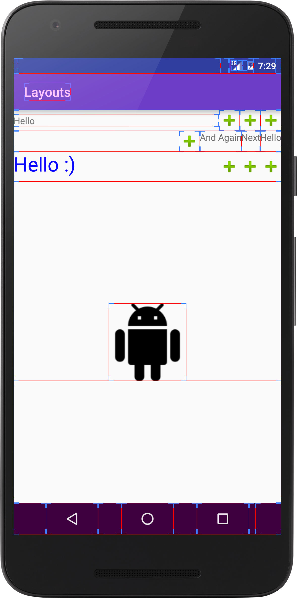

# First try of own CustomView(Group)

---
## What is it?
Just some examples of CustomViewGroups.

The first is the [TextImageView](https://github.com/StefMa/CustomViews/blob/master/app/src/main/java/guru/stefma/layouts/view/TextImageView.java) which extends from ViewGroup and measure and layout it own childs which will be inflated in it.

[RightToLeftLayout](https://github.com/StefMa/CustomViews/blob/master/app/src/main/java/guru/stefma/layouts/view/RightToLeftLayout.java) is a "fully" Android layout like a LinearLayout. You can use it in your XML like any other ViewGroups.
The childs will be measured from right to left. Instead from left to right (like a LinearLayout).

The last [TextImageFullyView](https://github.com/StefMa/CustomViews/blob/master/app/src/main/java/guru/stefma/layouts/view/TextImageFullyView.java) extends from View and put it "childs" via the onDraw(Canvas can) methods.
Touched (or clicks) are detected via an OnTouchListener.

--
## References
* Medium Performance Part [1](https://medium.com/android-news/prefmatters-using-custom-views-in-android-to-improve-performance-part-1-4dc9bdd75396), [2](https://medium.com/android-news/perfmatters-introduction-to-custom-viewgroups-to-improve-performance-part-2-f14fbcd47c), [3](https://medium.com/android-news/perfmatters-building-a-custom-viewgroup-part-3-165dae1bb5ff)
* TweetLayoutView [Blog](http://lucasr.org/2014/05/12/custom-layouts-on-android/), [Java](https://github.com/lucasr/android-layout-samples/blob/master/src/main/java/org/lucasr/layoutsamples/widget/TweetLayoutView.java), [XML](https://github.com/lucasr/android-layout-samples/blob/master/src/main/res/layout/tweet_layout_view.xml)
* [ProfilePhotoLayout](https://sriramramani.wordpress.com/2015/05/06/custom-viewgroups/)
